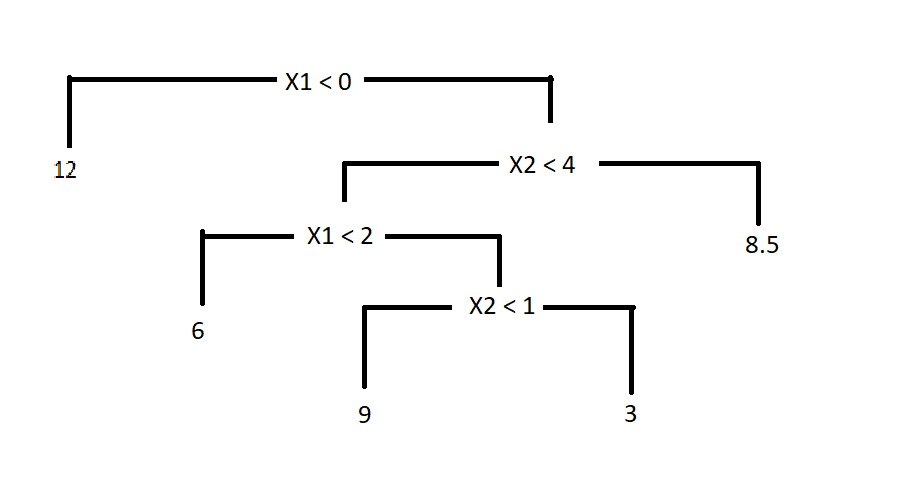

  
```{r setup, include=FALSE}
library(knitr)
knitr::opts_chunk$set(echo = TRUE,tidy=TRUE,message=FALSE,warning=FALSE,strip.white=TRUE,prompt=FALSE,
                      cache=TRUE, size="scriptsize",fig.width=4, fig.height=3,fig.align = "center")
```

```{r,eval=FALSE,echo=FALSE}
# install.packages("ggplot2")
# install.packages("tidyverse")
# install.packages("palmerpenguins")
# install.packages("GGally")
# install.packages("MASS")
# install.packages("caret")
# install.packages("leaps")
# install.packages("glmnet")
# install.packages("pls")
# install.packages("gam")
# install.packages("e1071")
# install.packages("tree")
# install.packages("randomForest")
# install.packages("ggfortify")
# install.packages("latex2exp")
```

<!--  Etc (load all packages needed). -->


# Problem 1

```{r, eval=T}
library(MASS)
str(Boston)
```

```{r, eval=T}
set.seed(1) 
# pre-processing by scaling
# NB! Strictly speaking, pre-processing should be done on a training set only and 
# it should be done on a test set with statistics of the pre-processing from 
# the training set. But, we're preprocessing the entire dataset here for convenience.
boston <- scale(Boston, center=T, scale=T)
# split into training and test sets
train.ind = sample(1:nrow(boston), 0.8 * nrow(boston)) 
boston.train = data.frame(boston[train.ind, ])
boston.test = data.frame(boston[-train.ind, ])
```

## a)
 
```{r, fig.height=5, fig.width=5,out.width='18cm', eval=T, echo=T}
library(leaps)
forward_selection = regsubsets(medv~., data=boston.train, 
                               method="forward", nvmax = ncol(boston.train) - 1)
forward_summary = summary(forward_selection)
backward_selection = regsubsets(medv~., data=boston.train, 
                                method="backward", nvmax = ncol(boston.train) - 1)
backward_summary = summary(backward_selection)
forward_summary$adjr2
library(latex2exp)
plot(c(1:(ncol(boston.train)-1)), forward_summary$adjr2, 
     xlab = "# of predictors", ylab = TeX(r'($Adj. R^2$)'), 
     col="blue", main = "RSS, Forward Selection")
lines(c(1:(ncol(boston.train)-1)), forward_summary$adjr2, col="blue")
points(c(1:(ncol(boston.train)-1)), backward_summary$adjr2, 
       xlab = "# of predictors", ylab = TeX(r'($Adj. R^2$)'), 
       col="red", main = "RSS, Backward Selection")
lines(c(1:(ncol(boston.train)-1)), backward_summary$adjr2, col="red")
legend(8, 0.6, legend=c("Forward", "Backward"), 
       col=c("blue", "red"), lty=c(1,1), cex=0.8)
```

## b)
```{r, eval=T, echo=T}
# According to F-selection, the 4 best predictors are lstat, rm, ptratio and dis
# We also must include the response, medv
best_pred = names(coef(forward_selection, 4))
best_pred = best_pred[2:5] # Remove the intercept
new_boston.train = boston.train[c(best_pred, "medv")]
```


## c)

(i)
```{r, eval=T, echo=T}
library(glmnet)
set.seed(1)
x_train <- model.matrix(medv~.,boston.train)[,-1]
y_train <- boston.train$medv
cv.out= cv.glmnet(x_train, y_train, alpha=1, nfolds = 5)
plot(cv.out)
```

(ii)
```{r, eval=T, echo=T}
best_lambda_lasso <- cv.out$lambda.min
cat("Best lambda:", best_lambda_lasso)
```

(iii)
```{r, eval=T, echo=T}
coef(cv.out, s = "lambda.min")
```

## d)

1. True
2. False
3. False
4. True

# Problem 2

```{r}
library(MASS)
set.seed(1)
# load a synthetic dataset
id <- "1CWZYfrLOrFdrIZ6Hv73e3xxt0SFgU4Ph" # google file ID
synthetic <- read.csv(sprintf("https://docs.google.com/uc?id=%s&export=download", id))
# split into training and test sets
train.ind = sample(1:nrow(synthetic), 0.8 * nrow(synthetic)) 
synthetic.train = data.frame(synthetic[train.ind, ])
synthetic.test = data.frame(synthetic[-train.ind, ])
# show head(..)
# Y: response variable; X: predictor variable
head(synthetic)
```

## a)

```{r, eval=T, echo=T}
set.seed(1)
library(pls)
pcr_fit = pcr(Y~., data=synthetic.train, scale=TRUE, validation="CV")
validationplot(pcr_fit, val.type = "MSEP", legendpos = "topright")

pls_fit = plsr(Y~., data=synthetic.train, scale=TRUE, validation="CV")
validationplot(pls_fit, val.type = "MSEP", legendpos = "topright")
```

## b) 
```{r, eval=T, echo=T}
library(GGally)
cor_matrix = round(cor(synthetic), 4)
cor_matrix

synthetic_princomp_1 = pcr_fit$loadings[,c('Comp 1')]
synthetic_plsr_princomp_1 = pls_fit$loadings[,c('Comp 1')]

print("Coefficients of principal component 1 (PCR): ")
synthetic_princomp_1
print("Coefficients of principal component 1 (PLSR): ")
synthetic_plsr_princomp_1
```
### Difference between PCR and PSLR

From the plots, we can see that PLSR performs substantially better than PCR. It captures most of the variability of the response using only 4 components. PCR, on the other hand, requires 10 components to match the result of PLSR, failing to reduce the dimensionality of the feature space. From the correlation matrix (provided above), we see that the covariates are highly uncorrelated, with the exception of X2 and X3 (rho = 0.95), and X1 and the response (rho = 0.70). This helps us explain why the PLSR is able to reduce the variance while also reducing the dimensionality. As this method considers the response when constructing a principal component, it uses the correlation between X1 and Y to capture most of the variability of the response in the first principal component. From the decomposition of the first principal component of PCA and PLSR, we do indeed see that the PLSR model has a large coefficient for X1, while the PCA has large coefficients for X2 and X3.


# Problem 3

## a)

1. True
2. False
3. False
4. True

## b)

```{r, eval=T, echo=T}
library(gam)
gam_fit = gam(medv~poly(rm, 1)+s(ptratio, df = 3)+poly(lstat, 2), data = boston.train)
plot(gam_fit, pages = 1)
# summary(gam_fit)
```


# Problem 4

## a)

1. False
2. True
3. True
4. True

## b)

See figure 1



## c)

```{r}
library(tidyverse)
library(palmerpenguins) # Contains the data set "penguins".
data(penguins)
names(penguins) <- c("species","island","billL","billD","flipperL","mass","sex","year")
Penguins_reduced <- penguins %>%  
  dplyr::mutate(mass = as.numeric(mass),  
         flipperL = as.numeric(flipperL),
         year = as.numeric(year)) %>% 
  drop_na()
# We do not want "year" in the data (this will not help for future predictions)
Penguins_reduced <- Penguins_reduced[,-c(8)]
set.seed(4268)
# 70% of the sample size for training set
training_set_size <- floor(0.7 * nrow(Penguins_reduced))
train_ind <- sample(seq_len(nrow(Penguins_reduced)), size = training_set_size)
train <- Penguins_reduced[train_ind, ]
test <- Penguins_reduced[-train_ind, ]
```

(i)
```{r, eval=T, echo=T}
set.seed(123)
library(tree)
penguin_simple_tree = tree(species~., data = train, method = "gini")
plot(penguin_simple_tree, type="uniform")
text(penguin_simple_tree, cex=0.7)
```

(ii)
```{r, eval=T, echo=T}
set.seed(123)
penguin_tree_huge = tree(species~., data = train, 
                         control = tree.control(nrow(train), 
                                   mincut = 2, minsize = 4, mindev = 0.001))
cv_tree_huge = cv.tree(penguin_tree_huge, K = 10)
plot(cv_tree_huge$dev ~  cv_tree_huge$size,type= "b", 
     lwd=2, col="red", xlab="Tree Size", ylab="Deviance", xlim=c(1, 10))
```

(iii)
```{r, eval=T, echo=T}
set.seed(123)
min_dev = which.min(rev(cv_tree_huge$dev))
prune_penguins = prune.tree(penguin_tree_huge, best = min_dev)
plot(prune_penguins, type="uniform")
text(prune_penguins, cex=0.7)
title("Pruned tree")

# We use majority vote to predict species (removing type = "class" will get 
# you the probabilities for each species for each observation)
simple_penguin_pred = predict(penguin_simple_tree, newdata = test, type = "class")
prune_penguin_pred = predict(prune_penguins, newdata = test, type = "class")

library(caret)
conf_mat_simple_penguin <- confusionMatrix(simple_penguin_pred, 
                                           reference = test$species)$table
conf_mat_simple_penguin

conf_mat_prune_penguin <- confusionMatrix(prune_penguin_pred, 
                                          reference = test$species)$table
conf_mat_prune_penguin


cat("Misclassification rate (simple tree):", 
    (1 - sum(diag(conf_mat_simple_penguin))/sum(conf_mat_simple_penguin[1:3, 1:3]))*100, "%\n")

cat("Misclassification rate (pruned tree):", 
    (1 - sum(diag(conf_mat_prune_penguin))/sum(conf_mat_prune_penguin[1:3, 1:3]))*100, "%\n")
```

## d)

```{r, eval=T, echo=T}
library(randomForest)
set.seed(4268)
misclass_rate = c()

for(i in 1:(ncol(train))) {
  rf_penguin = randomForest(species~., data = train, mtry = i, 
                            ntree = 500, importance = TRUE)
  rf_predict = predict(rf_penguin, type = "class")
  conf_penguin <- confusionMatrix(rf_predict, reference = train$species)$table
  misclass_rate[i] =  1 - sum(diag(conf_penguin))/sum(conf_penguin[1:3, 1:3])
}

plot(c(1:(ncol(train))), misclass_rate, type = "o", xlab = "# of predictors",
     ylab = "Misclassification rate")
best_mtry = which.min(misclass_rate)
cat("Best value for mtry:", best_mtry)

best_rf_penguin = randomForest(species~., data = train, mtry = best_mtry, 
                               ntree = 5000, importance = TRUE)
best_rf_predict = predict(rf_penguin, newdata = test, type = "class")
conf_test_penguin <- confusionMatrix(best_rf_predict, reference = test$species)$table
best_misclass_rate = 1 - sum(diag(conf_test_penguin))/sum(conf_test_penguin[1:3, 1:3])

cat("Misclassification error (mtry=3):", best_misclass_rate)

varImpPlot(best_rf_penguin, pch=20, main = "Random forest")
```

We use the out-of-bag (OOB) error rate to select the best value for mtry, the number of unique predictors considered at each split in a decision tree. When looping over the different values for mtry, we construct 500 trees. When constructing the final forest, we increase the number of trees to 5000 as this calculation only needs to be performed once. We found that the best value for m was 3, which is not surprising as $\sqrt{p}=\sqrt{7}\approx3$. From the variable-importance plots we can see that billL (bill length) and flipperL (flipper length) are the two most influential variables.

# Problem 5

## a)

1. False
2. True
3. True
4. True

## b)

(i)
```{r, eval=T, echo=T}
library(e1071)
set.seed(4268)
cv_svm_linear = tune(svm, species ~ ., data=train, kernel="linear", 
                     ranges = list(cost = c(0.01, 0.05, 0.1, 0.5, 1, 5, 10, 50, 100)))

cv_svm_radial = tune(svm, species ~ ., data=train, kernel="radial", 
                     ranges = list(cost = c(0.01, 0.05, 0.1, 0.5, 1, 5, 10, 50, 100),
                                   gamma = c(0.01, 0.05, 0.1, 0.5, 1, 5, 10, 50, 100)))

cv_svm_linear$best.parameters
cv_svm_radial$best.parameters


cat("Error rate training (linear):", cv_svm_linear$best.performance, "\n")
cat("Error rate training (radial):", cv_svm_radial$best.performance, "\n")

```

(ii)
```{r, eval=T, echo=T}
library(caret)
# We get the models with the optimal paramaters using the best.model attribute
best_linear = cv_svm_linear$best.model
best_radial = cv_svm_radial$best.model

best_linear_svm_predict = predict(best_linear, newdata = test, type = "class")
conf_test_penguin_linear <- confusionMatrix(best_linear_svm_predict, reference = test$species)$table
best_misclass_rate_lin=1-sum(diag(conf_test_penguin_linear))/sum(conf_test_penguin_linear[1:3,1:3])

best_radial_svm_predict = predict(best_radial, newdata = test, type = "class")
conf_test_penguin_radial <- confusionMatrix(best_radial_svm_predict, reference = test$species)$table
best_misclass_rate_rad=1-sum(diag(conf_test_penguin_radial))/sum(conf_test_penguin_radial[1:3,1:3])

print("Confusion matrix (linear):")
conf_test_penguin_linear

print("Confusion matrix (radial):")
conf_test_penguin_radial

cat("Misclassification rate (linear):", best_misclass_rate_lin, "\n")
cat("Misclassification rate (radial):", best_misclass_rate_rad, "\n")

```

(iii)
Both models performed extremely well, with a test error rate of 0. Because we are unable to distinguish the models based on performance, we select the most interpretable model, the SVM with a linear kernel. This model is in essence a p-dimensional hyperplane, and while it may not be visualized easily, the coefficients of the hyperplane can be interpreted.

```{r}
# load a synthetic dataset
id <- "1NJ1SuUBebl5P8rMSIwm_n3S8a7K43yP4" # google file ID
happiness <- read.csv(sprintf("https://docs.google.com/uc?id=%s&export=download", id)
                      ,fileEncoding="UTF-8-BOM")
colnames(happiness)
cols = c('Country.name', 
         'Ladder.score',  # happiness score
         'Logged.GDP.per.capita',  
         'Social.support', 
         'Healthy.life.expectancy', 
         'Freedom.to.make.life.choices',
         'Generosity',  # how generous people are
         'Perceptions.of.corruption')
# We continue with a subset of 8 columns:
happiness = subset(happiness, select = cols)
rownames(happiness) <- happiness[, c(1)]
# And we create an X and a Y matrix
happiness.X = happiness[, -c(1, 2)]
happiness.Y = happiness[, c(1, 2)]
happiness.XY = happiness[, -c(1)]
# scale
happiness.X = data.frame(scale(happiness.X))
str(happiness)
```


```{r, fig.height=9, fig.width=10,out.width='18cm'}
library(ggfortify)
pca_mat = prcomp(happiness.X, center=T, scale=T)
# Score and loadings plot:
autoplot(pca_mat, data = happiness.X, colour='Black',
         loadings = TRUE, loadings.colour = 'red',
         loadings.label = TRUE, loadings.label.size = 4, 
         label=T, label.size=3.5)
```

## a)

(i)

From the plot we see that GDP per capita, social support and and healthy life expcentacy are highly correlated. We can also observe that freedom to make life choices and perception of corruption are negatively correlated (an increase in one, would lead to a decrease of the other).

(ii) 

Afghanistan is the outlier, as it is far from any other country.

## b)

(i)

```{r, eval=T, echo=T}
set.seed(123)
princomp_1 = data.frame(pca_mat$rotation)$PC1
df = data.frame(pca_mat$rotation[, 1])
names = rownames(df)
labs <- substr(sapply(strsplit(names, " "), 
                      function(x) x[1]), 1, 10)
barplot(abs(princomp_1), xaxt = "n", xlab = "", ylab = "Importance", main = "PC1 (PCA)")
axis(1, at = 1:6, labels = labs, las = 2, cex.axis = 0.7)
princomp_1
```
```{r, eval=T, echo=T}
set.seed(123)
princomp_2 = data.frame(pca_mat$rotation)$PC2
barplot(abs(princomp_2), xaxt = "n", xlab = "", ylab = "Importance", main = "PC2 (PCA)")
axis(1, at = 1:6, labels = labs, las = 2, cex.axis = 0.7)
princomp_2
```

(ii)

```{r, eval=T, echo=T}
set.seed(123)
library(pls)
plsr_model = plsr(Ladder.score~., data=happiness.XY, scale=TRUE, validation="CV")
```

(iii)
```{r, eval=T, echo=T}
library(pls)
plsr_princomp_1 = plsr_model$loadings[,c('Comp 1')]
barplot(abs(plsr_princomp_1), xaxt = "n", xlab = "", ylab = "Importance", main = "PC1 (PLSR)")
axis(1, at = 1:6, labels = labs, las = 2, cex.axis = 0.7)
plsr_princomp_1
```

When plotting the principal component of the PCA model and the PLSR model, the bar graphs were quite similar. Although the signage of each coefficient was flipped, this doesn't matter as the variance captured by each principal component in both models is invariant up to sign.

(iv)

From the graph we see that GDP per capita, social support and healthy life expectancy are the three most important predictors to predict happiness in the PLSR model.

## c)

1. False
2. False
3. True
4. True

## d)

```{r, fig.height=10, fig.width=10, eval=T, echo = T}
K = 4
km.out = kmeans(happiness.X, K)
autoplot(pca_mat, data = happiness.X, colour=km.out$cluster,
         label=T, label.size=3.5,
         loadings = T, loadings.colour = 'blue',
         loadings.label = T, loadings.label.size = 4)
```


We assume that high GDP, social support, healthy life expectancy, freedom of choice and generosity contribute to a higher happiness, while corruption would lead to a decrease in happiness. From PC1 we see that GDP, social support, life expectancy, freedom of choice and corruption all have a large impact on the principal component. Furthermore, we see that the coefficient of the first 4 are all negative, while corruption has a positive coefficient. This suggests to us that a negative PC1 is correlated with a high happiness score.

Looking at principal component 2, we see that three most influential features are freedom of choice, generosity and perceived corruption, with generosity and freedom having negative coefficients, and corruption having a positive coefficient. This suggests that a negative value for PC2 indicates increased happiness, assuming our prior assumption about which features contribute to happiness holds.

From the PLSR model (which is fitted with regards to the response) we see however that generosity does not seem important when determining the happiness of a country. This might indicate that the importance of principle component 2 is slightly lower than that of principal component 1. Other than our assumption about generosity, the PLSR model also confirms our assumption about which features increase happiness, and which don't.

 - The black cluster has a low value for both principal components, suggesting a very high happiness score.
 - The red cluster generally has a low value for PC1, with a mid to high values for PC2. Since we believe that PC1 is more important with regards to happiness than PC2, this cluster seems to contain countries with a mid to high happiness score.
 - The blue cluster has average values for PC1 and high values for PC2. Again, since we regard PC1 as more important when determining happiness, these countries seem to have a mid happiness score.
 - The green cluster has high values for PC1 and average values for PC2. Again, the importance of PC1 outweighs PC2, and suggests that these countries have the lowest happiness score.